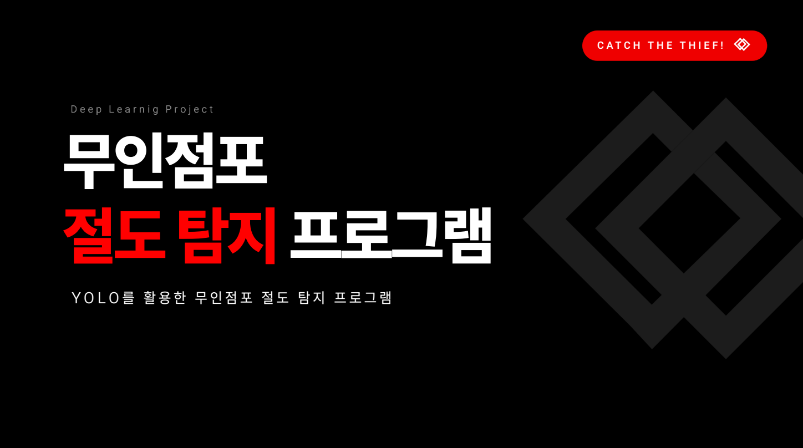

  

## 프로젝트 요약 [**(PDF 보기)**](./무인점포_절도탐지_프로그램.pdf)
YOLO 모델을 활용해 무인점포에서 절도 행위를 탐지하기 위한 딥러닝 기반 개발 프로젝트 입니다. 

## ✅진행 배경 
- **목표 및 방향성**: 무인 점포 수 증가와 함께 절도범죄 피해가 늘어남에 따라 이를 빠르게 탐지하고 신고가 이루어지게 하기 위한 시스템의 필요성을 느껴 개발을 진행

## 📊성과 및 결과  
- **결과물**: YOLO 기반 탐지 모델 개발 및 테스트, 동영상 절도 탐지 UI 및 exe 파일 제작, exe 파일 판매를 위한 웹사이트 구현
- **성과**: 절도 행동 탐지 정확도를 80%대까지 향상 

 
## 🛠사용 언어와 라이브러리 
- **프로그래밍 언어**: Python 
- **라이브러리 및 툴**: YOLOv8, OpenCV, TensorFlow, 등

## 📌프로젝트 진행 과정 
- **작업 단계**: 데이터 수집 및 라벨링 -> YOLO 모델 학습 및 튜닝 -> UI 및 exe 파일 개발 -> 판매가 이루어질 수 있는 간단한 웹사이트 개발 
- **역할 분담**: 모델 설계 및 성능 개선, UI화면 개발, exe 파일 만들기 

## ❗️한계점 및 어려웠던 점 
- **제약 조건**: 데이터 부족, YOLO8모델의 한계, GPU 성능 제한
- **해결 방법**: 데이터 증강 적용 
- **아쉬운점**: 시간 부족으로 다양한 절도 패턴 학습 어려움

## 💻학습 및 성장 
- **기술 향상**: YOLOV8 모델 튜닝 및 OpenCV 활용 능력 향상
- **팀워크 성장**: 역할 분담과 꾸준한 의사소통을 통한 문제 해결 능력 향상
- **개인적 성장**: 문제를 해결하고자 하는 끈기와 문제 해결 중심 사고 강화

